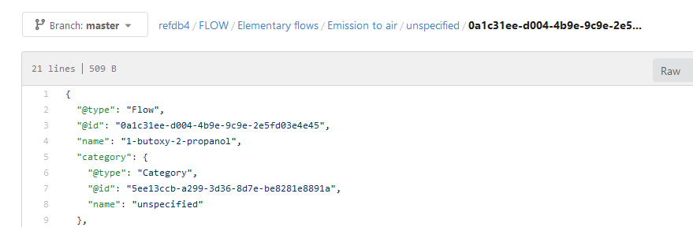

# olca-git
This is an experimental project for fast synchronization of openLCA databases
with Git repositories.

__Principles:__

* we directly access the object store in a bare repo (without working directory)
* the repo is synchronized with a descriptor tree of the database where model
  types and categories are the inner nodes and data set descriptors the leaves
* the root tree of the repo, that is linked to a commit, contains the links to
  the sub-trees of the respective model types (flows, processes, LCIA methods
  etc.) for which data are stored in the repo
* a sub-tree of the root tree contains links to other sub-trees (categories)
  or data set blobs of a specific data set type
* finally, the data sets are stored as blobs where the name of the blob has the
  format `<reference ID>_<version>.{json|proto}` (and the blob ID is the standard
  SHA-1 hash of the data set content)
* data sets can be stored in the olca-schema JSON or Protocol Buffers format



__Status/Findings:__

* Currently, only the storage of a complete database in a bare repository is
  supported
* Loading the complete descriptor tree of a database is quite fast and takes
  only 1-2 seconds for a database like ecoinvent 3.x with complete reference
  data
* The standard `ObjectInserter` of a file based repository in jgit is quite
  slow, but the `PackInserter` is super fast when using it in batch mode for
  all data sets of a sub-tree.
* Loading data sets from the database is then the limiting factor; doing this
  in blocks of threads using a cached thread pool is currently the fastest
  option
* A lot of time is spent on iterating over the indirect lists that are produced
  by EclipseLink when mapping objects from the database. This time can be
  massively reduced when switching to eager loading but then more data than
  necessary are loaded from the database which is even slower. There are
  maybe more options for improving the performance here.
* There is not much difference regarding the performance when writing the data
  in JSON or Protocol Buffers format (using olca-proto); but it has probably
  an influence when reading the data (this needs more tests)


Tests with writing a reference database with more than 60000 flows to a
repository:

```
a) |############################################################|
b) |########################################|
c) |###################################|
d) |########################|
e) |########################|
f) |###############|

a) single-threaded; standard inserter; 452.319 s
b) 2 new threads per tree; standard inserter; 299.584 s
c) cached thread-pool; standard inserter; 267.347 s
d) cached thread-pool; pack inserter; 180.076 s
e) cached thread-pool; pack inserter; batch db-loading; 177.578 s
f) cached thread-pool; pack inserter; 8 loader threads per tree; 115.239 s
```
